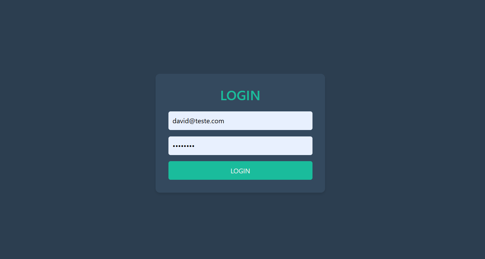
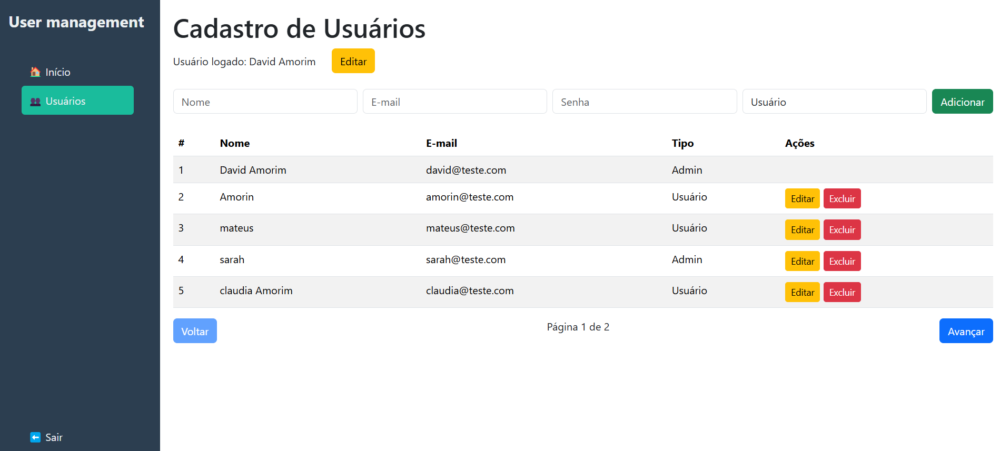
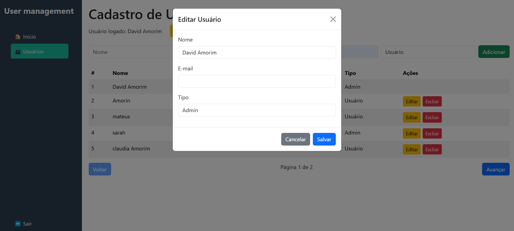

# Gestão de Usuários - React + Node.js + Express

Este projeto consiste em uma aplicação de gestão de usuários, 
onde existem dois tipos de usuários: **Admin** e **Normal**.

- O **usuário Admin** tem permissões completas, podendo **criar**, **editar** e **excluir** 
qualquer usuário do sistema.

- O **usuário Normal** tem permissões limitadas. Ele pode **visualizar** 
todos os usuários do sistema, mas só pode **editar seu próprio perfil**.

A aplicação foi construída utilizando:
- **Frontend**: React
- **Backend**: Node.js, Express
- **Banco de Dados**: SQLite
- **Autenticação**: JWT (JSON Web Token)

## Estrutura do Projeto

O projeto está organizado em duas pastas principais:
- `management-api`: Backend (API RESTful).
- `management-front`: Frontend (aplicação React).

### Estrutura do Backend (`management-api`)

```bash
management-api
├─ package-lock.json
├─ package.json
├─ src
│  ├─ config
│  │  └─ config.js
│  ├─ controllers
│  │  └─ userController.js
│  ├─ database
│  │  └─ database.sqlite
│  ├─ middleware
│  │  └─ authMiddleware.js
│  ├─ migrations
│  │  └─ 20241207152452-create-users.js
│  ├─ models
│  │  ├─ index.js
│  │  └─ user.js
│  ├─ routes
│  │  ├─ authRoutes.js
│  │  └─ userRoutes.js
│  ├─ seeders
│  │  └─ 20241207173046-demo-users.js
│  └─ server.js
```

- **Controllers**: Contém a lógica de negócios (CRUD de usuários, autenticação, etc.).
- **Models**: Define os modelos de dados utilizando Sequelize.
- **Routes**: Define as rotas para acessar os recursos de usuários e autenticação.
- **Middleware**: Controla o acesso e autenticação dos endpoints.

### Estrutura do Frontend (`management-front`)

```bash
management-front
├─ .gitignore
├─ dist
├─ public
│  └─ vite.svg
├─ src
│  ├─ App.jsx
│  ├─ components
│  │  └─ Sidebar.jsx
│  ├─ pages
│  │  ├─ Home.jsx
│  │  ├─ Login.jsx
│  │  └─ Users.jsx
│  ├─ services
│  │  └─ api.js
│  └─ main.jsx
└─ vite.config.js
```

- **Components**: Contém os componentes reutilizáveis, como a barra lateral.
- **Pages**: Contém as páginas da aplicação, como `Login`, `Home` e `Users`.
- **Services**: Contém serviços para fazer as requisições para a API backend.

## Instalação

### 1. Clonar o Repositório

```bash
git clone https://github.com/DavidAmon19/user-management
cd user-management
```

### 2. Instalar Dependências

Primeiro, instale as dependências do backend e frontend:

#### Backend

No diretório `management-api`, execute:

```bash
cd management-api
npm install
```

#### Frontend

No diretório `management-front`, execute:

```bash
cd management-front
npm install
```

### 3. Variáveis de Ambiente

No diretório `management-api`, crie um arquivo `.env` e adicione a seguinte variável de ambiente para a chave secreta do JWT:

```plaintext
JWT_SECRET=qualquercoisaquepodeestaaruse
```

**Nota**: Altere o valor da chave secreta conforme necessário. Esta chave é usada para assinar e verificar os tokens JWT.

### 4. Rodar as Migrations e Seeders

O projeto usa **migrations** e **seeders** para configurar o banco de dados e inserir dados iniciais. Para rodar as migrations e seeders, siga os seguintes passos:

1. **Rodar as Migrations**:

   No diretório `management-api`, execute o comando para rodar as migrations:

   ```bash
   npx sequelize-cli db:migrate
   ```

   Isso criará a tabela `Users` no banco de dados SQLite.

2. **Rodar os Seeders** (se desejar adicionar usuários de exemplo):

   Para rodar os seeders e adicionar usuários de exemplo ao banco de dados, execute:

   ```bash
   npx sequelize-cli db:seed:all
   ```

   Isso criará alguns usuários de exemplo para facilitar os testes.

### 5. Rodar o Projeto

#### Backend

No diretório `management-api`, execute o comando para rodar o servidor:

```bash
npm run dev
```

O backend estará rodando na porta **3001**.

#### Frontend

No diretório `management-front`, execute o comando para rodar o servidor de desenvolvimento:

```bash
npm run dev
```

O frontend estará acessível em **http://localhost:5173/**.

## Funcionalidades

- **Admin**:
  - Criar, editar e excluir usuários.
  - Visualizar todos os usuários.
- **Usuário Normal**:
  - Visualizar todos os usuários.
  - Editar seu próprio perfil.

### Dependências

#### Backend
- **Express**: Framework web para Node.js.
- **Sequelize**: ORM para interação com o banco de dados.
- **SQLite3**: Banco de dados leve em formato de arquivo.
- **JWT**: Utilizado para autenticação via tokens.
- **bcrypt**: Para criptografar senhas de usuários.

#### Frontend
- **React**: Biblioteca para construção de interfaces de usuário.
- **React Router**: Roteamento para navegação entre páginas.
- **Axios**: Biblioteca para fazer requisições HTTP.
- **Bootstrap**: Framework CSS para estilização.

## Notas

- Certifique-se de que o backend esteja rodando antes de acessar o frontend.
- O frontend utiliza `JWT` para autenticação. O token deve ser armazenado no armazenamento local (LocalStorage) no frontend para ser enviado nas requisições ao backend.

## Telas

### Tela de Login


### Página de Bem-vindo


### Cadastro de Usuários


### Editar Usuário

  
## Conclusão

Este projeto oferece uma implementação básica para gestão de usuários, com controle de permissões para usuários admin e normais. Ele usa um backend com Node.js e Express e um frontend com React. A autenticação é feita utilizando JWT, e o banco de dados SQLite é utilizado para persistir os dados de usuários.

---

```
